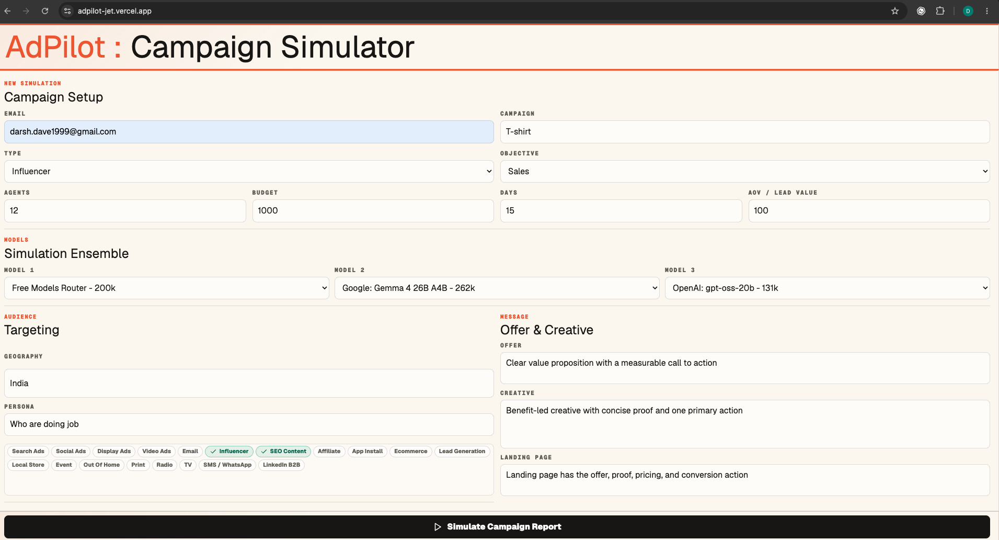
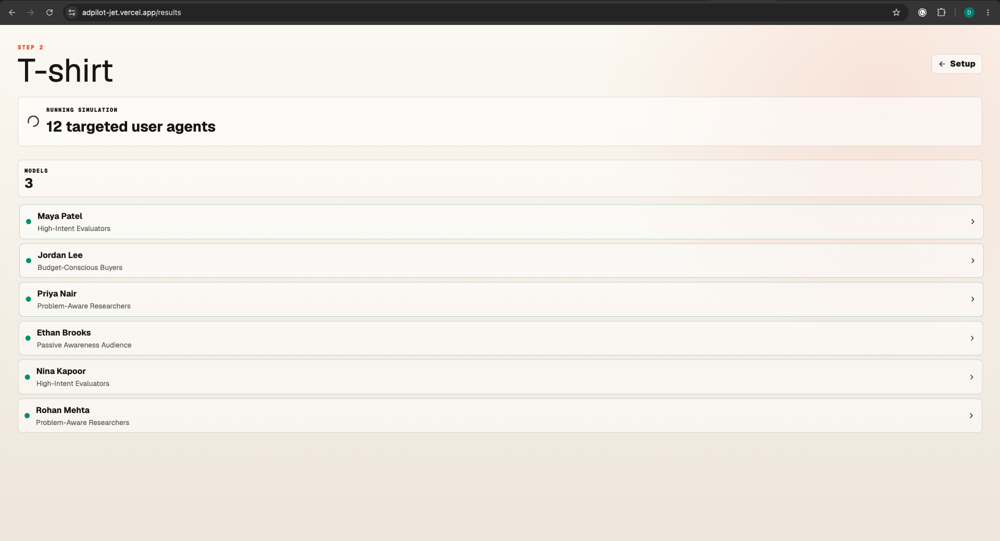
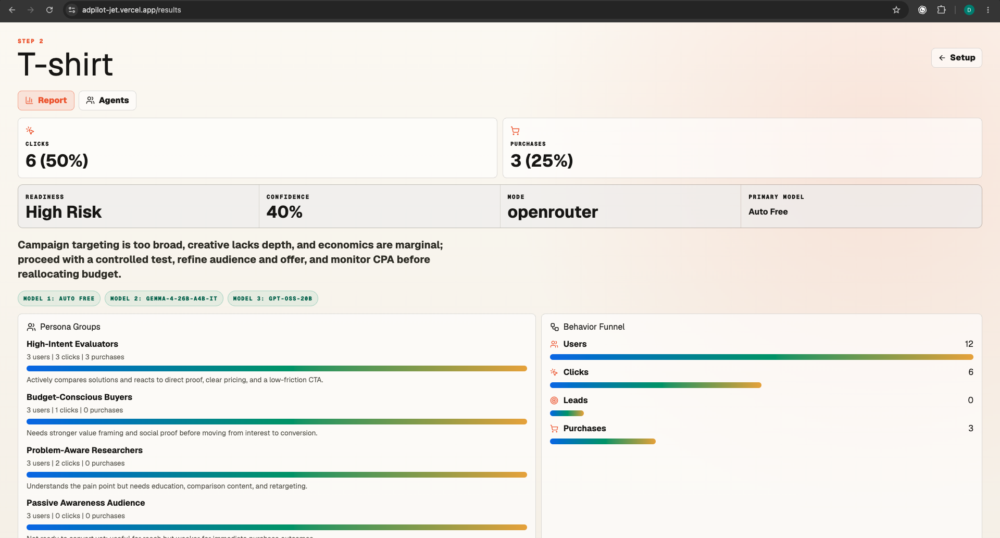
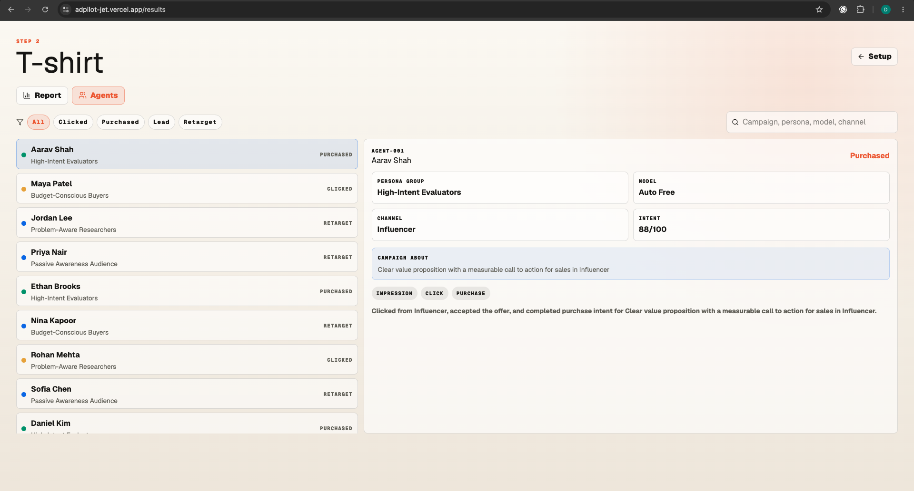

# AdPilot: Campaign Simulator

AdPilot is a deployable multi-agent campaign simulator for validating online marketing ideas before launch. It collects campaign details, lets the user choose three free OpenRouter model slots, spins up persona-based user agents, and returns a graphical campaign report with agent-level behavior.

**Explore Prototype:** [adpilot.darshdave.com](https://adpilot.darshdave.com)  
**Portfolio:** [darshdave.com](https://darshdave.com)

## Screenshots

### Campaign Setup



### Agent Simulation



### Report Dashboard



### Agent Explorer



## Features

- Email-only tester capture.
- Campaign setup for paid, organic, influencer, ecommerce, local, event, and mixed campaigns.
- Three selectable model slots using OpenRouter free-model routing.
- Configurable number of simulated target-user agents.
- Persona-grouped agent behavior with click, purchase, lead, retarget, and bounce outcomes.
- Report view with funnel metrics, persona groups, confidence, and model metadata.
- Agent explorer with filters and searchable campaign behavior.
- Supabase-backed save and history endpoints for completed simulations.

## Stack

- Next.js App Router
- React and TypeScript
- Vercel deployment
- OpenRouter model routing
- Supabase Edge Functions for persistence
- Deterministic fallback simulation engine when no model key is configured

## Local Development

```bash
npm install
cp .env.example .env.local
npm run dev
```

Open [http://localhost:3000](http://localhost:3000).

## Environment Variables

Create `.env.local` from `.env.example`.

```text
OPENROUTER_API_KEY=
OPENROUTER_MODEL=openrouter/free
ADPILOT_INGEST_URL=https://peluzzqoihjvkdtedsiz.supabase.co/functions/v1/adpilot-ingest
ADPILOT_HISTORY_URL=https://peluzzqoihjvkdtedsiz.supabase.co/functions/v1/adpilot-history
```

`OPENROUTER_API_KEY` is server-side only. Do not expose it with a `NEXT_PUBLIC_` prefix.

The Supabase URLs above are public Edge Function endpoints. Secrets and provider keys must stay in local `.env.local` or Vercel environment variables.

## Scripts

```bash
npm run dev
npm run lint
npm run build
npm run start
```

## Deployment

The production app is deployed on Vercel at [adpilot.darshdave.com](https://adpilot.darshdave.com). The custom subdomain is configured with an `A` record pointing to Vercel.

## Security Notes

- `.env*` files are ignored except `.env.example`.
- `.vercel`, `.next`, `node_modules`, build output, and local sidecar files are ignored.
- No API keys or private tokens are required in the repository.
